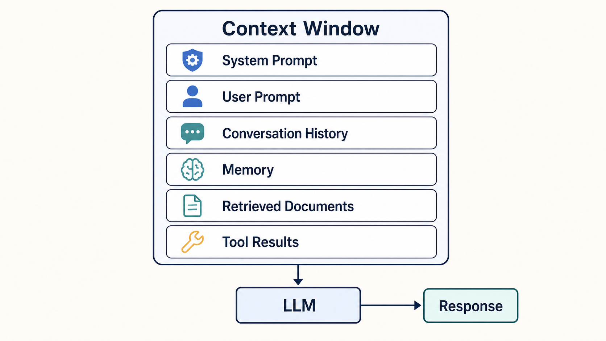

결국 LLM은 컨텍스트를 입력받고, 확률적으로 그럴법한 토큰을 뱉어내는 것에 불과하다.(주어진 컨텍스트에 조건부로 다음 토큰의 확률분포를 계산하고, 디코딩 방식에 따라 토큰을 선택) 하지만 꽤 유용하므로 잘 쓸 수 있는 방안을 고민 / 알아보자.

# LLM 에이전트

[[코딩 에이전트 확장 개념 정리#코딩 에이전트 확장 개념 정리 | 코딩 에이전트 개념 정리]] 에서 언급했듯이, 결국 코딩 에이전트 뿐만 아니라 AI 에이전트라고 부르는 것들은 다음 세 가지 요소를 제공 해 줌으로써 LLM이 에이전틱하게 동작할 수 있도록 돕는다.

1. <mark style="background:#d4b106">**LLM 컨텍스트에 정보를 넣는다.**</mark>
2. <mark style="background:#d4b106">**LLM이 호출할 수 있는 도구를 제공한다.**</mark>
3. <mark style="background:#d4b106">**LLM 바깥의 런타임이 특정 시점에 자동으로 개입한다.**</mark>

## 1. LLM의 지식과 컨텍스트

LLM이 답을 만드는 데 참고하는 정보는 크게 **정적 지식**과 **동적 지식**으로 나누어 볼 수 있다. 전자는 훈련을 통해 모델에 내재화된 능력과 패턴이고, 후자는 현재 요청을 처리하기 위해 컨텍스트에 넣는 정보다.

### 정적 지식

LLM은 본질적으로 수많은 정보의 빈칸 채우기를 통해서 학습된다. 이 과정에서 모델이 학습하는 정보에 의해 <mark style="background:#d4b106" title="훈련으로 파라미터에 분산적으로 내재화된 지식·패턴">파라미터에 저장된 '정적 지식'</mark>이 형성된다. 따라서 각 모델은 학습된 정보에 따라 knowledge cutoff가 있고, [[https://llm-stats.com/|학습된 정보에 따라 모델별로 특정 분야에 강점/약점]]을 보이기도 한다.

#### LLM knowledge cutoff

현 시점 대표적인 frontier 모델들의 knowledge cutoff를 살펴보면 다음과 같다.


| 모델              | 버전/변형                                      | Knowledge cutoff(공개 문서 기준) | 출처                                                                                                                                                                                                                                                           |
| --------------- | ------------------------------------------ | -------------------------- | ------------------------------------------------------------------------------------------------------------------------------------------------------------------------------------------------------------------------------------------------------------ |
| GPT-5.6         | `gpt-5.6`, `gpt-5.6-terra`, `gpt-5.6-luna` | 2026-02-16                 | [OpenAI API: GPT-5.6](https://developers.openai.com/api/docs/models/gpt-5.6-sol), [GPT-5.6 Terra](https://developers.openai.com/api/docs/models/gpt-5.6-terra), [GPT-5.6 Luna](https://developers.openai.com/api/docs/models/gpt-5.6-luna)                   |
| GPT-5.5         | `gpt-5.5`                                  | 2025-12-01                 | [OpenAI API: GPT-5.5](https://developers.openai.com/api/docs/models/gpt-5.5)                                                                                                                                                                                 |
| Claude Fable 5  | `claude-fable-5`                           | January 2026               | [Anthropic Help Center: training data cutoff](https://support.claude.com/en/articles/8114494-how-up-to-date-is-claude-s-training-data), [Anthropic Transparency Hub](https://www.anthropic.com/transparency?_bhlid=3366b91eeaceb766349f1b7ad4eebe6a2a89b8ce) |
| Claude Mythos 5 | `claude-mythos-5`                          | January 2026               | [Anthropic Transparency Hub](https://www.anthropic.com/transparency?_bhlid=3366b91eeaceb766349f1b7ad4eebe6a2a89b8ce)                                                                                                                                         |
| Claude Opus 4.8 | `claude-opus-4.8`                          | January 2026               | [Anthropic Transparency Hub](https://www.anthropic.com/transparency?_bhlid=3366b91eeaceb766349f1b7ad4eebe6a2a89b8ce)                                                                                                                                         |

### 동적 지식

이에 반해 <mark style="background:#d4b106">컨텍스트에 정보를 주입해서 알려줄 수 있는 '동적 지식'</mark>이 있다. 최신 문서, 현재 작업 중인 코드, 사용자의 취향, 대화 이력, 도구 호출 결과 등이 여기에 속한다. 컨텍스트에 넣었다고 파라미터가 바뀌는 것은 아니며, 다음 요청에서도 필요하다면 다시 넣어야 한다.


<div style="text-align: center;">

<br>
<small>gpt 생성 이미지</small>
</div>


#### 컨텍스트 관리

LLM은 매 토큰을 생성할 때 <mark style="background:#d4b106">현재 컨텍스트를 조건으로 다음 토큰의 확률을 계산한다. Transformer의 attention 메커니즘</mark>은 컨텍스트 안의 토큰들이 서로 관련성을 반영하도록 만들지만, 컨텍스트 윈도우는 유한하고 긴 입력에서 모든 정보가 똑같이 잘 활용되는 것도 아니다. 같은 모델이라도 어떤 지침·자료·도구 결과를 어떤 순서와 형식으로 넣느냐에 따라 답변이 달라지는 이유다.

<div style="text-align: center;">

<br>
<small>
출처: [Full GPT architecture](https://commons.wikimedia.org/wiki/File:Full_GPT_architecture.png) — Marxav, CC0 1.0
</small>
</div>


그래서 실제 LLM 활용에서는 <mark style="background:#d4b106">**컨텍스트 관리가 가장 중요한 요소 중 하나**다. 모델 자체의 능력 한계를 없앨 수는 없지만, 현재 문제에 필요한 사실·제약·작업 상태를 모델이 보게 만들 수 있다.</mark> 에이전트가 파일을 읽거나 웹을 검색한 뒤 결과를 다시 모델에게 보여주는 과정도 결국 동적 지식을 컨텍스트에 추가하는 과정이다.

컨텍스트 관리는 보통 다음 장치들을 함께 사용한다.

- **[[Memory]]**: 사용자 선호, 프로젝트 규칙, 이전 결정처럼 다음 세션에도 필요한 `정보를 외부에 보관하고, 관련될 때만 다시 주입`한다. 모델이 영구적으로 기억하게 되는 것과는 다르다.
- **[[RAG]]**: 문서·코드·DB에서 `현재 질문과 관련된 조각을 검색(retrieval)해 컨텍스트에 넣는다.` 검색 품질, 문서 최신성, 인용 범위가 답변 품질을 좌우한다.
- **[[요약과 압축]]**: `긴 대화나 작업 로그를` 그대로 누적하지 않고, 결정 사항·제약·미해결 과제를 보존한 `요약`으로 바꾼다.
- **[[캐싱]]**: 자주 반복되는 시스템 지침이나 큰 문서 `접두사를 재사용해 비용과 지연을 줄인다.`
- **[[Tool]]**: LLM은 컨텍스트에 제공된 `도구 설명`·입력 스키마·권한을 보고 필요할 때 호출을 제안한다. 런타임이 실제로 외부 시스템을 읽거나 변경한 뒤, 그 결과를 다시 컨텍스트에 넣는다. 따라서 도구는 `동적 지식을 **필요한 시점에 획득·갱신**하는 수단인 동시에 외부 세계에 영향을 주는 행동의 통로`다.


#### 컨텍스트 엔지니어링과 프롬프트 엔지니어링

LLM 초기에는 좋은 문장을 써서 모델을 원하는 방향으로 유도하는 **[[./_assets/Pasted image 20260713110339.png|프롬프트 엔지니어링]]** 이 크게 주목받았다. 지금도 시스템 프롬프트, 역할, 출력 형식, 예시를 설계하는 일은 중요하다. 다만 에이전트와 외부 데이터가 결합된 환경에서는 프롬프트만으로 충분하지 않다.

**컨텍스트 엔지니어링**은 프롬프트 엔지니어링을 포함하는 더 넓은 개념으로 볼 수 있다. 모델에게 더 좋은 답을 요구하는 일뿐 아니라, 답을 만드는 데 필요한 정보와 제약을 적절한 시점에 검색·선별·구성·갱신하는 일이다. 즉, `컨텍스트 엔지니어링 ≈ 프롬프트 엔지니어링의 확장판`에 가깝다.

보통 한 번의 실행에서 컨텍스트에는 다음과 같은 정보가 들어간다. 다만 이것은 설명을 위한 논리적 분류이며, 실제 메시지 순서와 캐시 키는 모델 제공자·API·에이전트 런타임마다 다르다.

```text
[재사용 가능한 prefix]
시스템/개발자 지침 · 프로젝트 규칙 · 도구 설명/권한 · 공통 문서

[대화 상태]
이전 사용자/모델 메시지 · 이전 도구 결과 · 요약된 작업 상태

[이번 실행의 가변 정보]
	현재 사용자 요청 · 이번에 검색한 문서 · 이번 도구 호출 결과
```

<mark style="background:#d4b106">캐시 효율만 보면, 자주 반복되고 변하지 않는 내용은 앞쪽에 고정하고 매번 달라지는 내용은 뒤쪽에 둔다.</mark> 대화 이력도 append-only로 유지된다면 이전 실행의 긴 prefix를 재사용할 수 있지만, 중간의 과거 메시지나 지침을 수정·삽입하면 그 지점 이후의 캐시는 보통 다시 계산해야 한다.

좋은 컨텍스트는 정보를 무작정 많이 넣는 것이 아니다. 다음이 중요하다.

- **관련성**: 현재 판단에 필요한 정보만 넣는다. 오래되었거나 무관한 내용은 오히려 판단을 흐릴 수 있다.
- **신뢰성**: 원문, 공식 문서, 실행 결과처럼 출처와 최신성을 확인할 수 있는 정보를 우선한다.
- **구조화**: 지침, 사실, 사용자 데이터, 인용문을 구분하고 출처·시간·적용 범위를 명시한다. 외부 문서는 명령이 아니라 참고 자료로 취급해야 한다.
- **갱신**: 작업 상태와 도구 결과가 바뀔 때 필요한 부분만 다시 읽거나 요약한다. 긴 작업에서는 이전 대화를 압축하되 결정·제약·미해결 사항은 보존해야 한다.
- **예산 관리**: 컨텍스트 윈도우는 유한하고 입력량은 비용·지연과도 연결된다. 필요한 정보를 검색해서 가져오고, 큰 자료는 필요한 부분만 넣는 편이 낫다.

즉, <mark style="background:#d4b106">LLM을 잘 활용한다는 것은 모델의 정적 지식에만 기대지 않고, 현재 문제에 맞는 동적 지식과 실행 결과를 지속적으로 공급하는 작업</mark>에 가깝다. 결국 중요한 것은 컨텍스트를 많이 채우는 것이 아니라, **지금 필요한 정보를 신뢰할 수 있는 형태로, 필요한 만큼만 넣는 것**이다.

## 2. LLM이 호출할 수 있는 도구(Tool)

LLM은 기본적으로 텍스트 생성기다.

텍스트 생성기가 직접 파일을 읽고, 웹을 검색하고, 데이터베이스를 조회하고, 메시지를 보내거나 코드를 실행하는 일을 하는 것이 아니다. 대신 런타임이 도구의 이름·설명·입력 스키마·권한 정보를 컨텍스트에 제공하면, LLM은 그 도구를 호출하겠다는 [[구조화된 요청]]을 생성할 수 있다. 이를 보통 function calling 또는 tool calling이라고 한다.

즉, <mark style="background:#d4b106">도구는 LLM의 출력이 **외부 정보의 조회와 외부 세계의 행동으로 이어지게 하는 인터페이스**다. </mark>
<mark style="background:#d4b106">LLM은 도구를 *호출하겠다고 제안*하고, 런타임은 인자·권한·정책을 검증한 뒤 실제 실행을 담당한다.</mark>
조회 결과는 다시 컨텍스트에 들어와 동적 지식이 되고, 그 정보를 바탕으로 모델이 다음 판단을 내린다.

### 도구 호출의 흐름

```text
런타임: 사용 가능한 도구와 권한을 LLM 컨텍스트에 제공
→ LLM: 필요하다고 판단한 도구와 인자를 구조화해 요청
→ 런타임: 인자·권한·정책을 검증하고 실제 도구 실행
→ 도구: 결과 또는 오류 반환
→ 런타임: 결과를 LLM 컨텍스트에 추가
→ LLM: 결과를 해석해 답변하거나 다음 도구 호출 결정
```

## 3. LLM 바깥의 런타임이 특정 시점에 자동으로 개입

위의 설명에서, 컨텍스트 관리와 도구의 필요성에 대해서 알아보았다.

따라서, 이를 실제로 운영하려면 LLM 바깥의 런타임이 특정 시점에 다음과 같은 일들을 자동으로 수행해야 한다.

### 컨텍스트와 관련된 일

런타임은 <mark style="background:#d4b106">매번</mark> LLM을 호출하기 전에, 현재 시점에서 모델이 보아야 할 <mark style="background:#d4b106">컨텍스트를 구성</mark>한다.

`어느 시점에, 어떤 정보를, 어떤 형식과 우선순위로 모델에게 보여 줄 것인가?`

매 호출 시점에 런타임이 현재 상태를 바탕으로 조립하는 **동적인 작업 공간**에 가깝다.

### 도구와 관련된 일

- LLM에게 사용 가능한 도구와 권한을 알려 준다.
- 도구 호출 전 인자와 권한을 확인하고, 필요하면 사용자 승인을 요청한다.
- <mark style="background:#d4b106">실행 및 실행 결과나 오류를 LLM이 다음 판단에 사용할 수 있도록 전달</mark>한다.

### 작업 흐름과 관련된 일

가장 기본적인 역할은 <mark style="background:#d4b106">**에이전트 루프</mark>를 유지하는 것**이다.

<div style="text-align: center;">

<br>
<small>출처 : https://code.claude.com/docs/en/how-claude-code-works</small>
</div>

- 현재 상태를 바탕으로 컨텍스트를 구성한다.
- LLM을 호출한다.
- 모델의 출력을 해석한다.
- 필요한 도구를 실행한다.
- 결과와 상태를 저장한다.
- 계속 진행할지, 종료할지, 사람에게 넘길지 판단한다.
- 필요한 경우 다시 LLM을 호출한다.


+시간과 이벤트 관리 : **시간, 상태 변화, 외부 이벤트, 모델 출력 등 시스템이 관찰할 수 있는 모든 조건**이 개입의 계기(LLM 호출)

+검증&안전장치

+관찰 가능성과 운영

+서브 에이전트 관리

+상태와 워크플로 관리 : LLM에게 모든 결정을 맡길 수도 있지만. 일반적으로 LLM에는 의미 판단처럼 유연성이 필요한 부분을 맡기고, 런타임에는 순서, 권한, 제한처럼 결정적으로 실행되어야 하는 부분을 맡긴다.


> [!summary] 정리
> 컨텍스트는 LLM이 **무엇을 알고 있는지**를 결정한다.
> 도구는 LLM이 **무엇을 할 수 있는지**를 결정한다.
> 런타임은 LLM이 **언제 생각하고, 어떤 행동을 실제로 수행하며, 작업을 어떻게 이어 갈지**를 결정한다.
