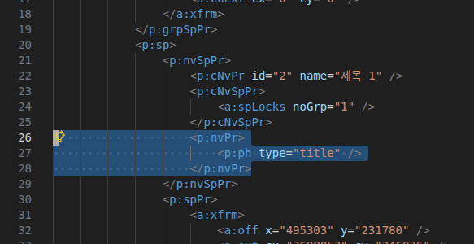
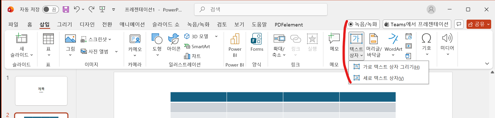
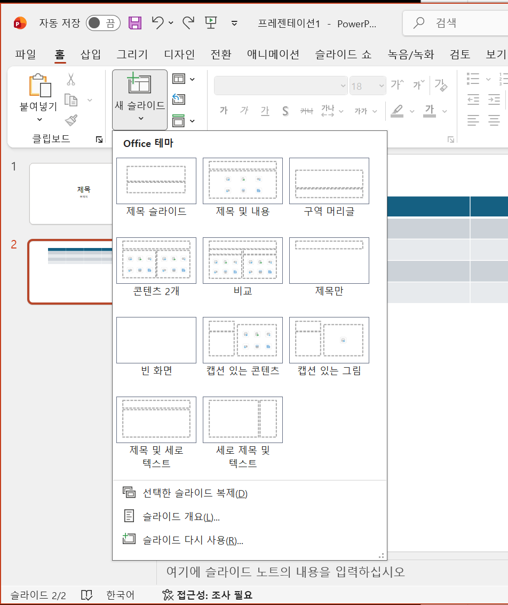
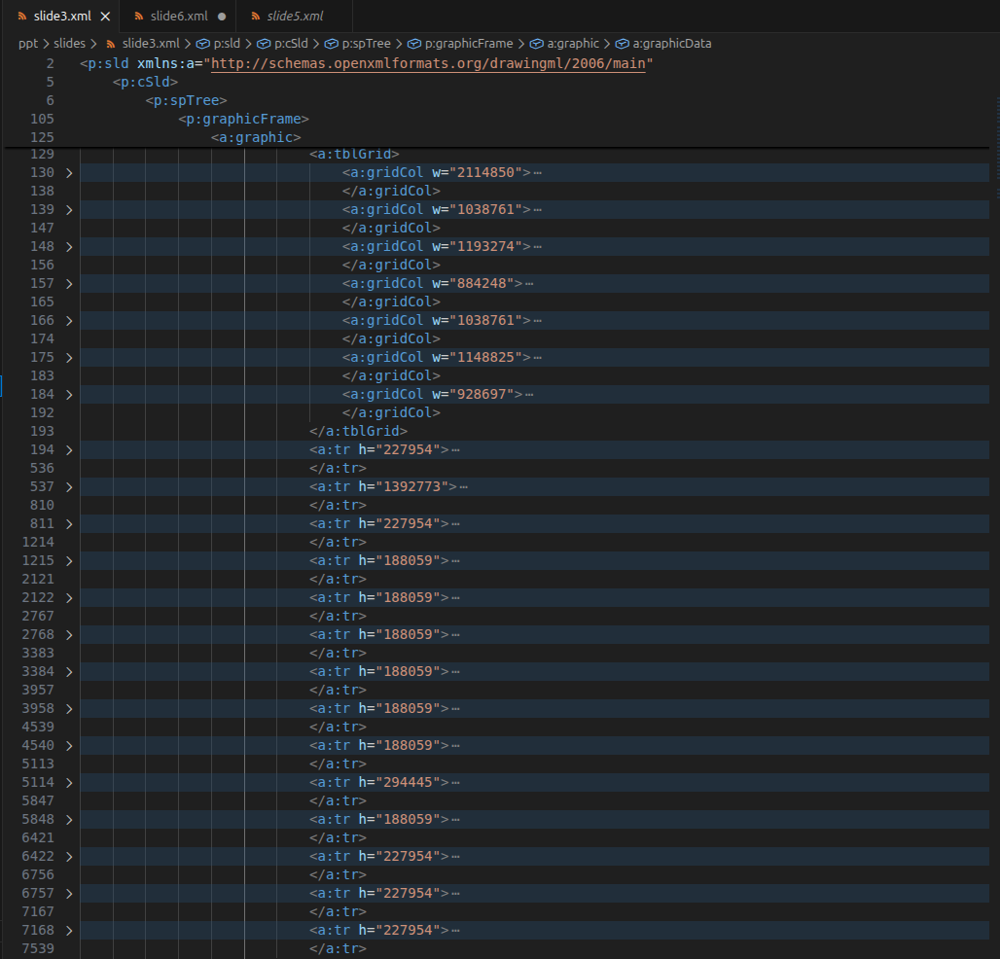
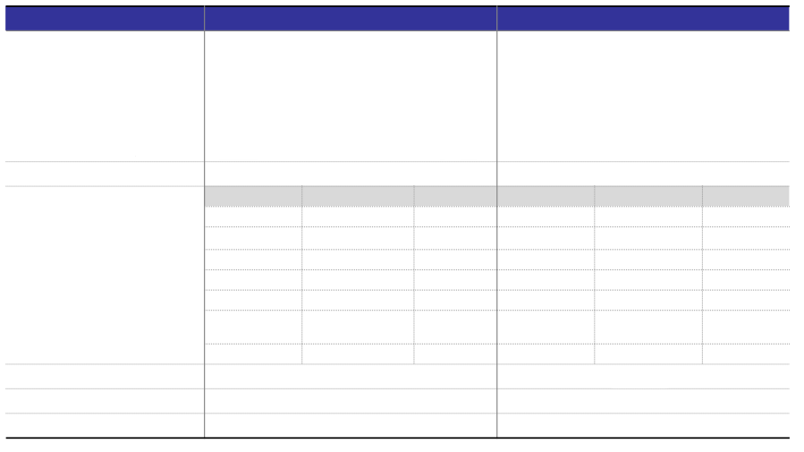

# slideX.xml의 핵심 구조 
`slideX.xml`은 Office Open XML (OOXML)(open office xml과 다르다.) (**ECMA-376** / **[ISO/IEC 29500-1](https://www.iso.org/standard/71691.html)**)의 프레젠테이션(PresentationML) 포맷에서 개별 슬라이드의 시각적 콘텐츠와 설정 정보를 담고 있는 핵심 파트이다. 

ISO/IEC 29500-1의 
- 19. PresentationML Reference Material ( - PresentationML(`p:`) 네임스페이스)
- 21. DrawingML - Components Reference Material ( - DrawingML(`a:`) 네임스페이스)

를 살펴보며, pptx2md 과정에서 참고할 만한 정보들을 알아보면 다음과 같다.

## 핵심 구성 요소 (Key Elements)

**최상위 요소(Root Element)**: 이 파트의 최상위 엘리먼트는 `<p:sld>`이다.

### 공통 슬라이드 데이터 (`<p:cSld>`)

`<p:cSld>`(Common Slide Data) 엘리먼트는 슬라이드의 유형과 무관하게 공통적으로 가지는 속성 및 시각적 객체 정보를 담는 컨테이너 역할을 한다. (ISO/IEC 29500-1의 19.3.1.16 cSld (Common Slide Data))

- **`<p:spTree>` (도형 트리)**: 슬라이드 내의 모든 시각적 객체를 계층적으로 관리하는 트리 구조. 하위 요소로 다음과 같은 객체들을 포함한다.
    - **`<p:sp>` (도형, Shape)**: <mark style="background:#d4b106">텍스트 상자</mark>나 기본 도형 객체 정보를 담는다.
    - **`<p:grpSp>` (그룹 도형, Group Shape)**: 여러 도형이 하나의 그룹으로 묶여 있는 상태를 나타낸다. 단일 변환(transform) 속성을 여러 도형에 동시에 적용할 때 사용된다.
    - **`<p:graphicFrame>` (그래픽 프레임)**: 외부 소스에서 생성된 그래픽 요소(<mark style="background:#d4b106">표</mark>, 차트 등)를 슬라이드 표면에 표시하기 위해 사용하는 컨테이너이다.
    - **`<p:cxnSp>` (연결선, Connection Shape)**: 두 개의 도형 객체(`<p:sp>`)를 서로 이어주는 연결선 정보를 정의.
    - **`<p:pic>` (사진/이미지, Picture)**: 슬라이드에 삽입된 이미지 객체를 정의한다.

## 주요 객체의 내부 구조

텍스트를 추출하거나 표 데이터를 읽어오려면 각 객체의 내부 구조를 파악해야 한다.

### `<p:sp>` (도형 및 텍스트 상자) 내부 구조

도형의 위치, 크기, 그리고 내부에 적힌 텍스트 정보는 다음 계층을 통해 정의된다.

- **`<p:nvSpPr>` (비시각적 속성)**: 도형의 고유 ID, 이름 등 메타데이터를 담는다. 특히 이 안에는 텍스트 상자의 **역할(제목, 부제목 등)**을 정의하는 요소가 포함되어 있다.
    - <mark style="background:#d4b106">**`<p:ph>` (플레이스홀더, Placeholder)**</mark>: `<p:nvPr>` 하위에 위치하며, 이 도형이 슬라이드 레이아웃에서 어떤 역할을 하는지 `type` 속성으로 나타낸다. (※ `type` 속성이 아예 없으면 사용자가 임의로 추가한 일반 텍스트 상자나 도형을 의미한다.)
        - `type="title"` : 일반 제목
        - `type="ctrTitle"` : 가운데 정렬된 제목 (주로 첫 제목 슬라이드)
        - `type="subTitle"` : 부제목
        - `type="body"` : 본문 텍스트
        - `type="dt"` : 날짜 및 시간
        - `type="sldNum"` : 슬라이드 번호
        - `type="ftr"` : 바닥글
        - 

예시

- **`<p:spPr>` (시각적 속성)**: 도형의 크기, 위치(x, y 좌표), 채우기 색상, 테두리 선 등의 기하학적 정보를 정의한다.
- **`<p:txBody>` (텍스트 본문)**: 도형 내부에 포함된 실제 텍스트 데이터 영역이다.
    - **`<a:p>` (문단, Paragraph)**: 하나의 문단을 나타낸다.
    - **`<a:r>` (텍스트 런, Run)**: 폰트, 크기, 색상 등 서식이 동일한 텍스트 조각이다. 한 문단 내에서도 서식이 바뀌면 여러 개의 `<a:r>`로 쪼개진다.
    - **`<a:t>` (텍스트, Text)**: 화면에 표시되는 실제 문자열 데이터가 들어있다.

일반 텍스트 상자

슬라이드 레이아웃

=> <mark style="background:#d4b106"><p:ph type="title">이나 <p:ph type="subTitle">로 들어가려면, 사용자가 파워포인트 화면에서 일반 텍스트 상자가 아닌 **슬라이드 레이아웃**을 이용해야 함.</mark>

### `<p:graphicFrame>` 내부의 표(Table) 구조

표 데이터는 `<p:graphicFrame>` 내부의 `<a:graphic>` ➔ `<a:graphicData>` 안에 `<a:tbl>` 형태로 존재한다. <mark style="background:#d4b106">HTML의 테이블 구조와 매우 유사</mark>하다.

- **`<a:tbl>` (표, Table)**: 표 객체의 최상위 요소이다.
    - **`<a:tblGrid>` (표 그리드)**: <mark style="background:#d4b106">표의 전체 열(Column) 구조와 각 열의 너비(`<a:gridCol>`)를 정의</mark>한다.
    - **`<a:tr>` (행, Table Row)**: <mark style="background:#d4b106">표의 가로 행</mark>을 나타낸다.
        - **`<a:tc>` (셀, Table Cell)**: 행 내부의 개별 칸을 나타낸다. 셀 병합 정보(rowSpan, gridSpan)도 이곳에 포함된다.
	        - **`<a:tcPr>`(셀 속성)** : 내부의 **채우기(Fill) 속성** 설정 가능
		        -  <mark style="background:#d4b106">=> 다른 표를 이미지로 캡처한 뒤, 해당 셀의 배경을 `<a:blipFill>`(이미지 채우기)로 설정하여 그림으로 집어넣을 수 있다.</mark>
            - **`<a:txBody>` (텍스트 본문)**: 셀 안에 입력된 텍스트 정보이다. 구조는 위 도형의 텍스트 본문(`<a:p>` ➔ `<a:r>` ➔ `<a:t>`)과 완벽하게 동일하다. 

예시 테이블 - xml

예시 테이블 - 렌더링

=> <mark style="background:#d4b106">예시 테이블은 눈으로 볼 때 nested 구조인 것으로 보이지만, xml을 보면 실제로는 테이블 1개이다. nested 형태로 column이나 row를 차지하게 **디자인**(내부 테이블로 보이는 것은 하나의 row와 column 차지, 외부 테이블로 보이는 것은 여러 row와 column 차지) 한 것이나 다름 없다.</mark>

### `<p:graphicFrame>` 내부의 OLE 객체 (워드, 엑셀 등 삽입)

슬라이드에 삽입된 워드 문서(`.docx`)나 엑셀 파일(`.xlsx`)은 시각적으로는 슬라이드 위에 떠 있는 이미지나 표처럼 보이지만, 내부적으로는 **OLE 객체(`<p:oleObj>`)** 형태로 연결되어 있다.

- **`<p:oleObj>` (OLE 객체)**: `<p:graphicFrame>` ➔ `<a:graphic>` ➔ `<a:graphicData>` 하위에 위치하며, 삽입된 외부 문서(워드, 엑셀 등)의 정보를 담고 있다.
    - **`progId` 속성**: 삽입된 객체의 프로그램 종류를 나타낸다. (예: `Word.Document.12`는 워드 문서, `Excel.Sheet.12`는 엑셀 시트)
    - **`r:id` 속성**: 실제 파일이 저장된 위치를 가리키는 관계 ID(Relationship ID).

#### OLE 객체의 실제 파일이 저장되는 위치(`ppt/embeddings/`)

`slideX.xml` 내부에는 워드 문서의 텍스트가 직접 적혀 있지 않다. 대신 PPTX 파일(ZIP 압축) 내부의 특정 폴더에 실제 파일이 통째로 저장된다.

1. **`slideX.xml`**: `<p:oleObj r:id="rId3" progId="Word.Document.12" />` 형태로 ID만 기록.
2. **`_rels/slideX.xml.rels`**: `rId3`가 `../embeddings/Microsoft_Word_Document1.docx`를 가리킨다고 정의.
3. **`ppt/embeddings/` 폴더**: 이 폴더 안에 실제 삽입된 워드 파일 (`Microsoft_Word_Document1.docx`)이나 엑셀 파일이 물리적으로 존재한다. [[pptx 파일 구조 #3. 리소스 및 외부 데이터|(pptx 파일 구조에서 언급)]] 

## 정리
> [!summary] 정리
> 텍스트의 경우 
> 1. 슬라이드 레이아웃이 설정되어 있으면 title인지 아닌지 확인 가능  
> => 설정이 안 되어 있으면 일반 텍스트로 인식
> 2. 텍스트는 <a:t>에 있음.
>
> 테이블의 경우 여러 방법으로 입력 했을 수 있음.
> 1. 실제로는 테이블 1개이지만, nested 형태로 column이나 row를 차지하게 **병합**한 경우 (앞선 예시 이미지)
> 2. OLE 객체를 **삽입**한 경우 (앞서 설명)
> 3. 별개의 객체로 겹쳐 놓은 경우 (해당 셀에 넣은게 아니고, 따로 테이블을 만들어서 해당 셀 위에 보이도록 **위치** 시킨 것)
> 4. 이미지로 캡처해서 **배경**으로 넣은 경우 (앞선 <a:tcPr> 설명)
>
> 수식의 경우도 여러 방법으로 입력 했을 수 있음.
> 1. 수식처럼 보이게 위치(ex. $2^x$를 2따로 x 따로 크기조절해서 위치시키는 경우)
> 2. OMML로 들어간 경우
> 3. latex로 들어가 있는 경우
> 4. 이미지로 들어가 있는 경우
>
> 이미지의 경우  
> 1. [[pptx 파일 구조#3. 리소스 및 외부 데이터|media/]]에 파일로 있음.  <- 이미지는 파일 추출 및 description