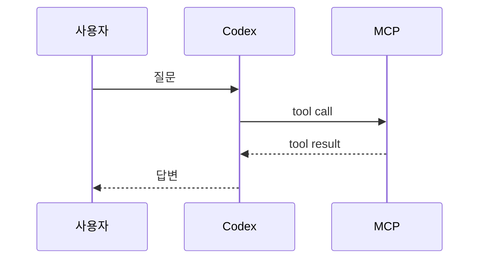
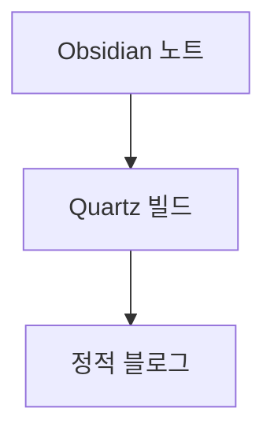

# Quartz 기능

Quartz는 `content/` 폴더 안의 Markdown 파일을 읽어서 디지털 가든/블로그 형태의 정적 사이트로 만들어준다. 이 블로그에서는 Obsidian으로 `content/` 아래 노트를 쓰고, Quartz가 그 노트를 웹사이트로 빌드하는 구조다.

> 이 노트는 Quartz v4.5.2 기준으로 처음 작성되었다. v5 migration 이후 실제 설정은 `quartz.config.yaml`과 [[Quartz v5 마이그레이션 계획]]을 기준으로 확인한다.

## 현재 이 블로그에서 켜진 기능

현재 설정 기준으로 이미 활성화된 기능은 다음과 같다.

| 기능 | 현재 상태 | 근거 파일 |
|---|---:|---|
| Obsidian 문법 지원 | 켜짐 | `quartz.config.ts`의 `Plugin.ObsidianFlavoredMarkdown()` |
| GitHub Flavored Markdown | 켜짐 | `Plugin.GitHubFlavoredMarkdown()` |
| Frontmatter 파싱 | 켜짐 | `Plugin.FrontMatter()` |
| 생성/수정일 처리 | 켜짐 | `Plugin.CreatedModifiedDate()` |
| 코드 하이라이팅 | 켜짐 | `Plugin.SyntaxHighlighting()` |
| 목차 생성 | 켜짐 | `Plugin.TableOfContents()` + `Component.TableOfContents()` |
| 내부 링크 크롤링 | 켜짐 | `Plugin.CrawlLinks()` |
| 설명 자동 생성 | 켜짐 | `Plugin.Description()` |
| LaTeX 수식 | 켜짐 | `Plugin.Latex()` |
| draft 필터링 | 켜짐 | `Plugin.RemoveDrafts()` |
| 폴더 페이지 | 켜짐 | `Plugin.FolderPage()` |
| 태그 페이지 | 켜짐 | `Plugin.TagPage()` |
| 검색/그래프/RSS용 색인 | 켜짐 | `Plugin.ContentIndex()` |
| RSS | 켜짐 | `ContentIndex({ enableRSS: true })` |
| 사이트맵 | 켜짐 | `ContentIndex({ enableSiteMap: true })` |
| 이미지/정적 파일 처리 | 켜짐 | `Plugin.Assets()`, `Plugin.Static()` |
| alias/permalink redirect | 켜짐 | `Plugin.AliasRedirects()` |
| 소셜 미리보기 이미지 | 켜짐 | `Plugin.CustomOgImages()` |
| SPA 라우팅 | 켜짐 | `enableSPA: true` |
| 링크 hover preview | 켜짐 | `enablePopovers: true` |
| 한국어 UI | 켜짐 | `locale: "ko-KR"` |
| Giscus 댓글 | 켜짐 | `quartz.layout.ts`의 `Component.Comments()` |
| 검색 UI | 켜짐 | `Component.Search()` |
| 다크모드 | 켜짐 | `Component.Darkmode()` |
| 리더모드 | 켜짐 | `Component.ReaderMode()` |
| 왼쪽 탐색기 | 켜짐 | `Component.Explorer()` |
| 그래프 뷰 | 켜짐 | `Component.Graph()` |
| 백링크 | 켜짐 | `Component.Backlinks()` |
| Breadcrumbs | 켜짐 | `Component.Breadcrumbs()` |

## 글 작성에서 바로 쓸 수 있는 기능

### Frontmatter

각 노트 상단에 메타데이터를 넣을 수 있다.

```md
---
title: 글 제목
description: 검색 결과와 링크 미리보기에 쓸 설명
created: 2026-07-07
modified: 2026-07-07
draft: false
tags:
  - topic/quartz
  - status/growing
aliases:
  - 다른 이름
comments: true
enableToc: true
---
```

자주 쓸 필드는 다음 정도면 충분하다.

| 필드                  | 용도                                        |
| ------------------- | ----------------------------------------- |
| `title`             | 페이지 제목. 없으면 파일명이 제목이 된다.                  |
| `description`       | 검색/공유/목록에서 쓰는 설명. 없으면 본문 앞부분으로 자동 생성된다.   |
| `created`           | 생성일. 현재 설정에서 날짜 우선순위가 frontmatter를 먼저 본다. |
| `modified`          | 수정일. Obsidian 플러그인으로 자동 갱신 가능하다.          |
| `draft`             | `true`면 빌드 결과에서 제외된다.                     |
| `tags`              | 태그 페이지와 검색에서 사용된다.                        |
| `aliases`           | 다른 URL/이름에서 이 노트로 redirect를 만들 수 있다.      |
| `permalink`         | 파일 경로가 바뀌어도 유지할 고정 URL.                   |
| `comments`          | `false`면 해당 글의 댓글을 끈다.                    |
| `enableToc`         | `false`면 해당 글의 목차를 숨긴다.                   |
| `socialImage`       | 소셜 공유 카드 이미지를 직접 지정한다.                    |
| `socialDescription` | 소셜 공유용 설명을 따로 지정한다.                       |

### Wikilinks

Obsidian처럼 `[[...]]` 링크를 쓸 수 있다.

```md
[[코딩 에이전트 확장 개념 정리]]
[[코딩 에이전트 확장 개념 정리|다른 표시 이름]]
[[코딩 에이전트 확장 개념 정리#MCP]]
```

이미지도 wikilink로 넣을 수 있다.

```md
![[Pasted image 20260217154403.png]]
![[Pasted image 20260217154403.png|500x300]]
```

전체 페이지나 특정 heading을 transclude하는 문법도 지원한다.

```md
![[다른 노트]]
![[다른 노트#특정 heading]]
```

### Callouts

Obsidian callout 문법을 쓸 수 있다.

```md
> [!note]
> 일반 메모

> [!tip] 핵심
> 글에서 강조하고 싶은 팁

> [!warning]
> 주의할 점
```

접기/펼치기 callout도 가능하다.

```md
> [!question]+ 펼쳐진 질문
> 내용

> [!example]- 접힌 예시
> 내용
```

자주 쓸 타입:

- `note`
- `info`
- `tip`
- `question`
- `warning`
- `danger`
- `example`
- `quote`

### 코드 블록

코드 하이라이팅은 빌드 타임에 처리된다.

````md
```ts
const value: string = "hello"
```
````

파일명을 붙일 수 있다.

````md
```ts title="src/main.ts"
const value: string = "hello"
```
````

특정 줄을 강조할 수 있다.

````md
```ts {1-2,4}
function hello() {
  return "world"
}
```
````

특정 단어를 강조할 수 있다.

````md
```js /useState/
const [count, setCount] = useState(0)
```
````

인라인 코드도 언어를 붙일 수 있다.

```md
`const x = 1`{:ts}
```

### LaTeX 수식

인라인 수식:

```md
$e^{i\pi} = -1$
```

블록 수식:

```md
$$
f(x) = \int_{-\infty}^{\infty} \hat f(\xi)e^{2\pi i \xi x}\,d\xi
$$
```

주의할 점: 블록 수식의 `$$`는 별도 줄에 두는 것이 안전하다.

### Mermaid 다이어그램

Mermaid 코드 블록으로 다이어그램을 그릴 수 있다.

````md

````

흐름도도 가능하다.

````md

````

### 표, 체크박스, 취소선, footnote

GitHub Flavored Markdown이 켜져 있어서 다음 문법을 쓸 수 있다.

```md
| 이름 | 설명 |
|---|---|
| Quartz | Markdown 기반 정적 사이트 생성기 |

- [ ] 할 일
- [x] 완료

~~취소선~~

각주 예시[^1]

[^1]: 각주 내용
```

## 사이트 탐색 기능

### 검색

왼쪽 사이드바의 검색창이나 `Ctrl + K`로 전체 검색을 할 수 있다. 태그 검색은 `#`로 시작하거나 `Ctrl + Shift + K`를 쓸 수 있다.

```text
react
#topic/quartz
```

검색은 제목, 본문, 태그를 색인한다. 한국어/중국어/일본어 토큰화도 고려되어 있다.

### Explorer

왼쪽 탐색기는 `content/` 아래 폴더와 파일 구조를 보여준다. 폴더별 `index.md`를 만들면 폴더 이름과 설명을 커스터마이즈할 수 있다.

예:

```text
content/코딩 에이전트/index.md
```

해당 파일에 다음처럼 쓴다.

```md
---
title: 코딩 에이전트
description: LLM 기반 코딩 에이전트의 구조와 확장 방식 정리
---

이 폴더는 코딩 에이전트 관련 노트를 모은다.
```

### Breadcrumbs

페이지 상단에 현재 글의 폴더 경로가 표시된다. 깊은 폴더 구조를 쓸 때 현재 위치를 보여주는 용도다.

### Folder listing

Quartz는 폴더별 목록 페이지를 자동 생성한다.

```md
[[코딩 에이전트/]]
[[분류 전/]]
```

폴더에 `index.md`가 있으면 그 내용이 폴더 설명으로 쓰인다.

### Tag listing

각 태그별 페이지가 자동 생성된다.

```md
[[tags/topic/quartz]]
```

태그는 계층형으로 쓸 수 있다.

```md
tags:
  - topic/quartz
  - type/concept
  - status/growing
```

이 경우 `topic`, `topic/quartz` 같은 계층 페이지가 만들어질 수 있다.

### Graph view

오른쪽 사이드바의 그래프는 현재 노트와 연결된 노트를 보여준다. 내부 링크가 많을수록 그래프가 의미 있어진다.

잘 쓰려면 글 안에서 관련 개념을 적극적으로 링크해야 한다.

```md
[[MCP]]
[[Skill]]
[[Hook]]
[[코딩 에이전트 확장 개념 정리]]
```

### Backlinks

현재 글을 링크한 다른 글 목록이 오른쪽에 표시된다. 하나의 개념 노트를 여러 글에서 참조하면 백링크가 자동으로 지식 맵 역할을 한다.

### Popover previews

내부 링크에 마우스를 올리면 링크 대상 페이지의 미리보기가 뜬다. 글을 읽는 중 다른 개념을 빠르게 확인할 때 좋다.

### Table of Contents

heading을 기준으로 목차가 자동 생성된다.

```md
## 큰 제목

### 작은 제목
```

특정 글에서 목차가 필요 없으면 frontmatter에 넣는다.

```md
---
enableToc: false
---
```

## 발행/공유 기능

### Draft

현재 설정에서는 `draft: true`인 글이 빌드 결과에서 제외된다.

```md
---
draft: true
---
```

주의: Markdown 페이지만 제외된다. 이미지, PDF 같은 비 Markdown 파일은 별도로 공개될 수 있으므로 민감한 파일은 `content/`에 두지 않는 것이 안전하다.

### Ignore patterns

`quartz.config.ts`의 `ignorePatterns`로 아예 처리하지 않을 경로를 지정할 수 있다.

현재 설정:

```ts
ignorePatterns: ["private", "templates", ".obsidian"]
```

즉 `private`, `templates`, `.obsidian`은 Quartz 처리 대상에서 제외된다.

### RSS

현재 RSS가 켜져 있다.

```text
https://lis-blog.pages.dev/index.xml
```

RSS를 제대로 쓰려면 `baseUrl`이 현재처럼 정확히 설정되어 있어야 한다.

```ts
baseUrl: "lis-blog.pages.dev"
```

### Sitemap

현재 사이트맵도 켜져 있다.

```text
https://lis-blog.pages.dev/sitemap.xml
```

검색 엔진이 블로그 페이지를 발견하는 데 도움을 준다.

### Social preview

`Plugin.CustomOgImages()`가 켜져 있어서 페이지별 소셜 미리보기 이미지를 생성할 수 있다.

특정 이미지를 직접 지정하려면 frontmatter를 쓴다.

```md
---
socialImage: ./cover.png
socialDescription: 이 글은 Quartz 기능을 정리한다.
---
```

### Comments

현재 Giscus 댓글이 켜져 있다. 특정 글에서 댓글을 끄려면:

```md
---
comments: false
---
```

## UI/읽기 기능

### Dark mode

다크모드 버튼이 켜져 있다. 사용자가 선택한 모드는 브라우저 local storage에 저장된다.

### Reader mode

리더모드 버튼이 켜져 있다. 누르면 사이드바가 숨겨져 글 읽기에 집중할 수 있다.

### SPA routing

현재 `enableSPA: true`라서 페이지 이동 시 전체 새로고침 대신 부드럽게 전환된다.

### Korean locale

현재 `locale: "ko-KR"`이라 Quartz UI 문구가 한국어 기준으로 표시된다.

## 지금 설정에는 없지만 추가 가능한 기능

### Recent Notes

최근 글 목록 컴포넌트를 추가할 수 있다. 현재 레이아웃에는 들어가 있지 않다.

```ts
Component.RecentNotes({
  title: "최근 글",
  limit: 5,
})
```

### Citations

BibTeX 기반 인용을 지원하는 플러그인이 있지만 현재 설정에는 켜져 있지 않다.

```md
[@templeton2024scaling]
```

논문 정리 노트를 많이 쓸 때 유용하다.

### Explicit publish

현재는 `draft: true`만 제외하는 방식이다. 반대로 `publish: true`가 있는 글만 공개하는 방식도 가능하다.

```md
---
publish: true
---
```

이 방식을 쓰려면 `RemoveDrafts` 대신 `ExplicitPublish` 필터를 쓰도록 설정을 바꿔야 한다.

## 추천 사용법

### 기본 노트 템플릿

```md
---
title: 제목
created: 2026-07-07
modified: 2026-07-07
draft: false
tags:
  - topic/
  - type/concept
  - status/seed
---

# 제목

## 핵심 질문

## 정리

## 예시

## 관련 노트

- [[]]
```

### 태그 규칙

Quartz 태그 페이지를 잘 쓰려면 태그를 너무 많이 만들지 않는 편이 좋다.

추천:

```text
topic/quartz
topic/coding-agent
topic/react
topic/rust

type/concept
type/article
type/index
type/log

status/seed
status/growing
status/evergreen
```

### 폴더와 태그의 역할

```text
폴더 = 블로그의 큰 공개 구조
태그 = 글의 성격과 상태
링크 = 개념 사이의 실제 관계
```

### Quartz에서 특히 잘 먹히는 글쓰기 방식

긴 글 하나를 계속 키우기보다, 작은 개념 노트를 만들고 서로 링크하는 방식이 좋다.

예:

```text
content/코딩 에이전트/
  index.md
  MCP는 context가 아니라 tool interface다.md
  Skill은 언제 주입되는가.md
  Hook은 런타임 계층이다.md
```

그리고 `index.md`에서 묶는다.

```md
# 코딩 에이전트

## 확장 표면

- [[MCP는 context가 아니라 tool interface다]]
- [[Skill은 언제 주입되는가]]
- [[Hook은 런타임 계층이다]]
```

## 기능별 참고 문서

로컬 문서 기준:

- `docs/authoring content.md`
- `docs/features/Obsidian compatibility.md`
- `docs/features/wikilinks.md`
- `docs/features/callouts.md`
- `docs/features/syntax highlighting.md`
- `docs/features/Latex.md`
- `docs/features/Mermaid diagrams.md`
- `docs/features/full-text search.md`
- `docs/features/graph view.md`
- `docs/features/backlinks.md`
- `docs/features/table of contents.md`
- `docs/features/folder and tag listings.md`
- `docs/features/private pages.md`
- `docs/features/RSS Feed.md`
- `docs/features/comments.md`
- `docs/plugins/Frontmatter.md`
- `docs/plugins/ContentIndex.md`

